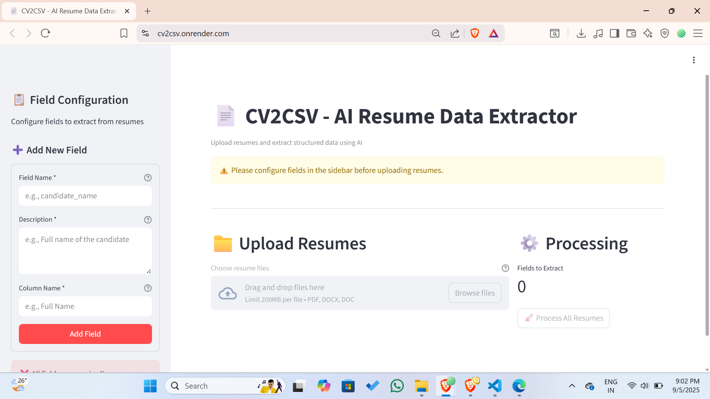
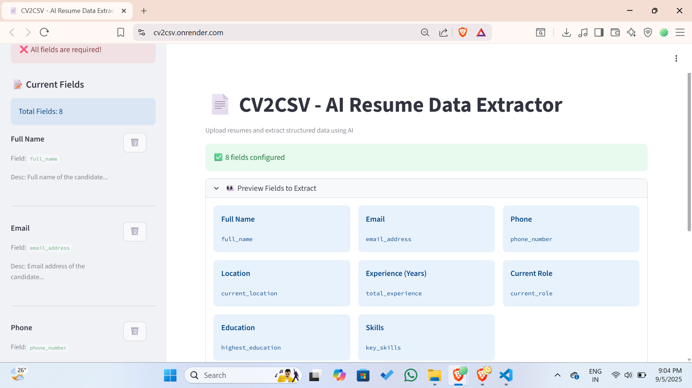
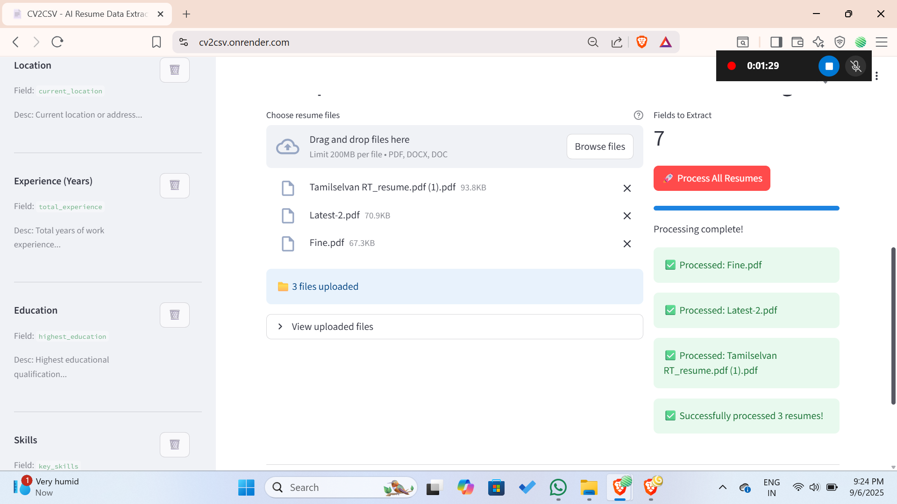
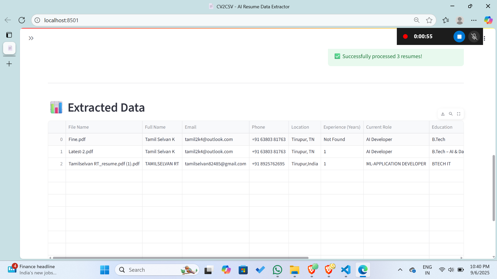
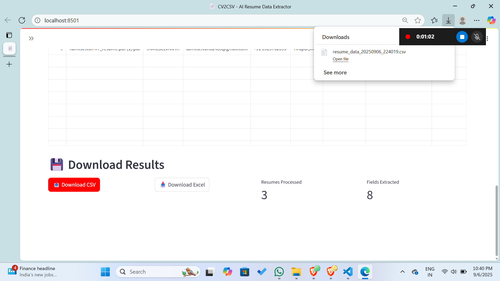

# 📄 CV2CSV – AI Powered Resume to CSV/Excel Extractor  

🚀 **CV2CSV** is an AI-powered tool that converts unstructured resumes (PDF, DOCX, DOC) into clean, structured data (CSV/Excel).  
Built with **Streamlit + Google Gemini AI**, it helps recruiters, HR teams, and colleges quickly extract candidate details like **name, email, phone, skills, education, and work experience** — without manual copy-paste.  

---

## 🌐 Try It Online  

👉 [cv2csv.onrender.com](https://cv2csv.onrender.com)  

No setup required — just upload your resume and see the results instantly! 🎉  

---

## 🎥 Demo  

👉 [Watch Full Demo Video](https://your-demo-video-link)  

---

## 🖼️ Application Preview  

<p align="center">
  
</p>

<p align="center">
  
</p>

<p align="center">
  
</p>

---

## ✨ Why CV2CSV?  

- **🤖 AI-Powered Extraction** – Smart resume parsing using Google Gemini  
- **🧩 Dynamic Fields** – Add custom fields based on your needs  
- **📂 Batch Processing** – Upload multiple resumes at once  
- **⚡ Ready Templates** – HR, Education, and Basic Resume templates  
- **📤 Export Anywhere** – Download structured data in CSV or Excel  
- **⏱️ Time Saver** – No more manual resume screening  

---

## 🖼️ Example Output  

| File        | Full Name   | Email            | Phone          | Skills         | Education   | Processed Date |
|-------------|-------------|------------------|----------------|----------------|-------------|----------------|
| resume1.pdf | John Doe    | john@email.com   | +91-9876543210 | Python, SQL    | B.Tech CSE  | 2025-09-05     |
| resume2.docx| Jane Smith  | jane@email.com   | +91-9876501234 | ML, Django    | MBA         | 2025-09-05     |

<p align="center">
  
</p>

---

## 🔑 API & Model Configuration  

CV2CSV supports **Bring Your Own Google Gemini API Key**, making it safe and scalable for multiple users.

### 🔐 Configuration Steps

1. Open the app
2. In the **left sidebar (top)**, expand **API & Model Configuration**
3. Enter your **Google Gemini API Key**
4. Select a model or enter a **custom model name**

### ✅ Supported Models (Default)

- `gemini-flash-latest`
- `gemini-2.0-flash-lite`
- `gemini-2.0-flash`
- **Custom model name** (user-defined)

<p align="center">
  
</p>

🔒 **Security Note:**  
Your API key is stored only in the current session and is never logged or saved.

---

## ⚡ Quick Start (Local Setup)  

### 1️⃣ Clone the repository  
```bash
git clone https://github.com/classytamil/cv2csv.git
cd cv2csv
````

### 2️⃣ Install dependencies

```bash
pip install -r requirements.txt
```

### 3️⃣ (Optional) Add API key via `.env`

Create a `.env` file:

```env
GOOGLE_API_KEY=your_api_key_here
```

> 💡 You can also enter the API key directly in the UI (recommended).

### 4️⃣ Run the app

```bash
streamlit run app.py
```

---

## 🛠️ Tech Stack

* **Streamlit** – Interactive web application
* **Google Gemini AI** – Resume understanding & extraction
* **PyPDF2 / python-docx** – Resume text extraction
* **Pandas + OpenPyXL** – CSV & Excel generation

---

## 📌 Use Cases

* 🎓 **Colleges** – Collect and analyze student resumes
* 💼 **HR Teams** – Fast candidate screening
* 🚀 **Startups** – Build talent databases quickly
* 🧪 **AI Developers** – Resume parsing & NLP experiments

---

## 📂 Project Structure

```
cv2csv/
│── app.py              # Main Streamlit application
│── cv2con.py           # Resume text extraction utilities
│── requirements.txt    # Python dependencies
│── .env.example        # Environment variable template
│── assets/             # Screenshots & demo images
│    ├── 1.png
│    ├── 2.png
│    ├── 3.png
│    ├── 4.png
│    ├── 5.png
│── README.md
```

---

## 🤝 Contributing

Contributions are welcome!
Feel free to:

* Add new resume field templates
* Improve extraction accuracy
* Enhance UI/UX

Open an issue or submit a pull request 🚀

---

## 📜 License

MIT License – free to use, modify, and distribute.

```

---
